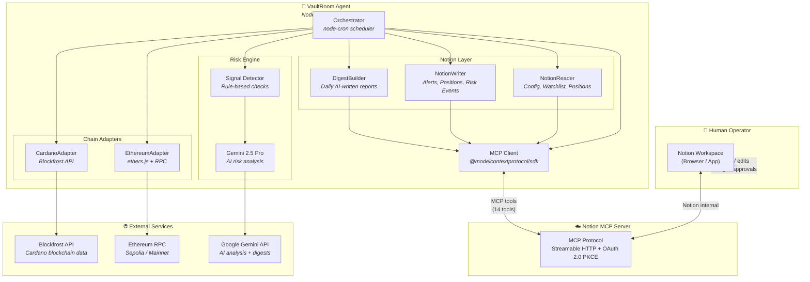
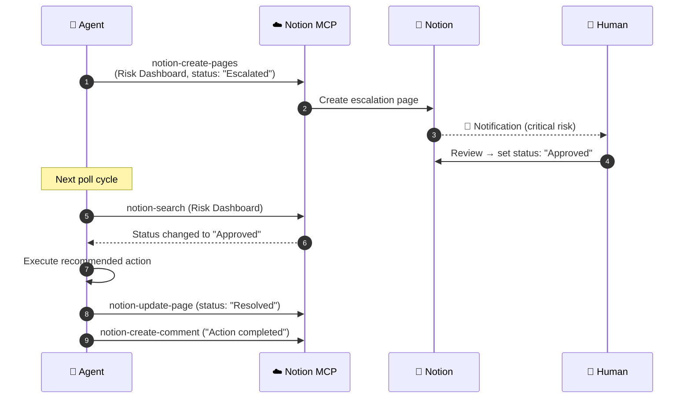

# 🏦 VaultRoom

**Multi-chain DeFi risk agent with Notion as the control plane — powered by Notion MCP.**

> Built for the [Notion MCP Challenge](https://dev.to/challenges/notion-2026-03-04) · March 2026

---

## The Problem

DeFi operators managing positions across Cardano and Ethereum rely on scattered tools — Discord bots for alerts, spreadsheets for tracking, Telegram for coordination. There's no single source of truth, no structured escalation workflow, and no human-in-the-loop approval for critical actions.

## The Solution

VaultRoom turns Notion into a DeFi risk control plane. An AI agent monitors on-chain positions, detects anomalies, and writes structured risk analysis directly into Notion databases — **entirely through Notion MCP**.

Human operators configure thresholds, approve escalations, and receive AI-written daily digests. All without leaving Notion.

> **Notion isn't a dashboard. It's the control plane. MCP is the protocol.**

---

## Architecture



> 📐 Detailed diagrams: [Architecture](docs/architecture.md) · [Data Flow & Sequences](docs/data-flow.md)

---

## Notion MCP Integration

VaultRoom uses **6 Notion MCP tools** as its entire Notion interface:

| MCP Tool | VaultRoom Usage |
|---|---|
| `notion-search` | Locate existing positions for upsert before writing |
| `notion-fetch` | Read Config DB, Watchlist, poll for escalation approvals |
| `notion-query-database-view` | Query databases with filters (active configs, approved escalations) |
| `notion-create-pages` | Write risk events, positions, alerts, daily digests |
| `notion-update-page` | Update position health, resolve escalations |
| `notion-create-database` | One-time workspace setup (6 databases) |
| `notion-create-comment` | Agent comments on escalated Notion pages to acknowledge resolution |

**Zero `@notionhq/client` usage.** Every Notion interaction goes through the remote MCP server at `https://mcp.notion.com/mcp`.

Page content is written as **Notion-flavored Markdown** — the MCP server converts `>` blockquotes → callouts, `<details>` → toggles, and standard Markdown tables into rich Notion blocks automatically.

---

## Bidirectional Control Flow

**Human → Agent** (operator configures via Notion UI):
- Set health factor thresholds per wallet
- Add/remove wallets and protocols to monitor
- Approve or reject escalated critical events

**Agent → Human** (VaultRoom writes via MCP):
- Real-time position tracking with health factors
- AI-analyzed risk events with severity scoring
- Daily portfolio digests with Gemini-written recommendations
- Comments on escalated pages acknowledging resolution

### Escalation Loop (the MCP showcase)



---

## Key Features

### 1. Multi-Chain Monitoring
- **Cardano** via Blockfrost API — ADA balances, native tokens, recent transactions
- **Ethereum** via public RPC — ETH balance, top ERC-20s (USDC, USDT, WETH, WBTC, DAI)

### 2. Rule-Based Risk Detection
- **Health factor** — severity tiers: `< 1.0` critical, `< 1.1` high, `< threshold` medium
- **Whale movement** — single tx > 10% of wallet balance → high signal
- **Balance drop** — `> 20%` drop since last cycle → high/critical

### 3. AI Enrichment (Gemini 2.5 Pro)
High and critical signals get AI analysis: 2-3 sentence assessment + recommended action. Gemini can also adjust severity based on context.

### 4. Rich Daily Digests
Full portfolio briefing published as a Notion page with tables, callouts, and toggles — all via Markdown converted by the MCP server.

### 5. Human-in-the-Loop Escalation
Critical alerts land in Notion with "Escalated" status. The agent polls and auto-resolves when a human approves — leaving a timestamped comment in the Notion discussion thread.

---

## Quick Start

### Prerequisites
- Node.js 20+, pnpm
- Notion account with MCP OAuth access
- Blockfrost API key — [blockfrost.io](https://blockfrost.io)
- Gemini API key — [aistudio.google.com](https://aistudio.google.com)

### Setup

```bash
# 1. Clone and install
git clone https://github.com/phamthanhhang208/vault-room.git
cd vault-room
pnpm install

# 2. Configure environment
cp .env.example .env
# Fill in: BLOCKFROST_API_KEY, GEMINI_API_KEY, then run: pnpm run setup:auth
# Authorize VaultRoom at https://notion.so/my-integrations to get OAuth token

# 3. Create Notion workspace (6 databases via MCP)
pnpm run setup

# 4. Add wallet config in Notion ⚙️ Config database, then run demo
pnpm run demo
```

### CLI Commands

| Command | Description |
|---|---|
| `pnpm run demo` | Scripted demo — full 2-min showcase |
| `pnpm run cycle` | Single monitor cycle and exit |
| `pnpm run digest` | Generate today's digest and exit |
| `pnpm dev` | Continuous monitoring with cron scheduler |
| `pnpm run setup` | Initialize Notion workspace via MCP |

---

## Tech Stack

| Layer | Technology |
|---|---|
| Runtime | Node.js 20 + TypeScript (strict) |
| MCP Client | `@modelcontextprotocol/sdk` (Streamable HTTP transport) |
| Notion MCP | Remote hosted — `https://mcp.notion.com/mcp` (OAuth 2.0) |
| Cardano | `@blockfrost/blockfrost-js` |
| Ethereum | `ethers` v6 |
| AI | `@google/generative-ai` (Gemini 2.5 Pro) |
| Scheduler | `node-cron` |
| Validation | `zod` |
| Logging | `winston` |

---

## Environment Variables

```bash
# Notion MCP (OAuth)
NOTION_MCP_URL=https://mcp.notion.com/mcp
MCP_ACCESS_TOKEN=             # Run `pnpm run setup:auth` to get this via OAuth
NOTION_REFRESH_TOKEN=         # Optional — for automatic token renewal

# Notion DB IDs (auto-populated by pnpm run setup)
NOTION_CONFIG_DB_ID=
NOTION_WATCHLIST_DB_ID=
NOTION_RISK_DASHBOARD_DB_ID=
NOTION_POSITIONS_DB_ID=
NOTION_ALERT_LOG_DB_ID=
NOTION_DIGESTS_PAGE_ID=

# Blockchain
BLOCKFROST_API_KEY=           # Get at blockfrost.io
BLOCKFROST_NETWORK=mainnet    # mainnet | preprod | preview
ETH_RPC_URL=https://eth.llamarpc.com

# AI
GEMINI_API_KEY=               # Get at aistudio.google.com
```

---

## Why This Matters

I build DeFi products professionally — lending protocols on Cardano. The risk scenarios in VaultRoom reflect real operational challenges that DeFi teams face daily: fragmented monitoring, no structured escalation, and no AI-assisted triage.

No other submission in this challenge touches DeFi. VaultRoom brings genuine domain expertise to a problem real operators face, using Notion as the control plane and MCP as the protocol layer.

---

*Built solo for the Notion MCP Challenge · March 2026*
