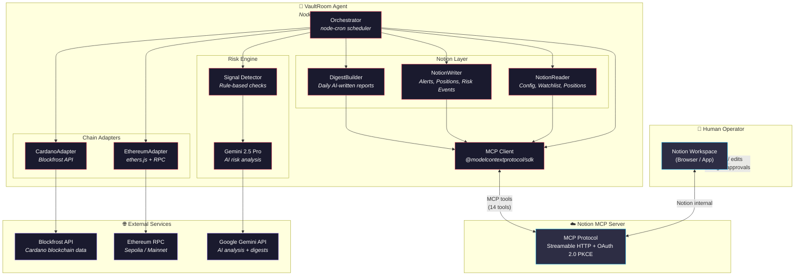

# VaultRoom — Architecture

## System Overview

## Component Summary

| Component | Role | Key Tech |
|-----------|------|----------|
| **Orchestrator** | Schedules monitor cycles, coordinates all subsystems | `node-cron` |
| **MCP Client** | Communicates with Notion via MCP protocol | `@modelcontextprotocol/sdk` |
| **NotionReader** | Reads config, watchlist, positions from Notion DBs | MCP `notion-search`, `notion-fetch` |
| **NotionWriter** | Writes alerts, positions, risk events to Notion | MCP `notion-create-pages`, `notion-update-page` |
| **DigestBuilder** | Generates daily AI-written portfolio reports | MCP `notion-create-pages` + Gemini |
| **Signal Detector** | Rule-based risk checks (health factor, TVL drop, whale moves) | Custom rules |
| **Gemini AI** | Enriches risk signals with analysis and recommendations | `@google/generative-ai` |
| **CardanoAdapter** | Fetches Cardano wallet data (balances, txs, staking) | `@blockfrost/blockfrost-js` |
| **EthereumAdapter** | Fetches Ethereum wallet data (balances, tokens, txs) | `ethers` v6 |
