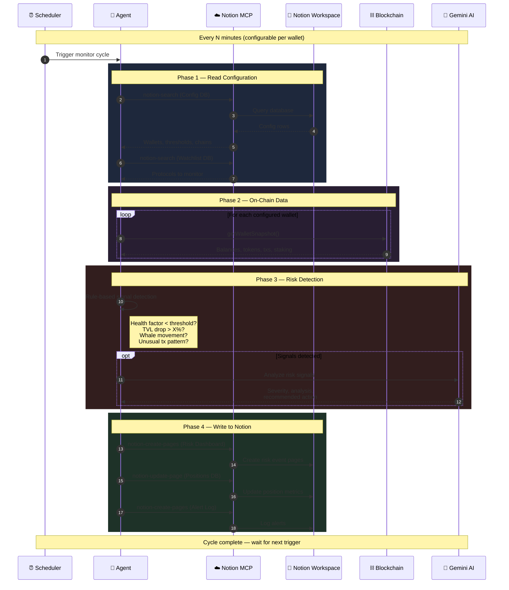
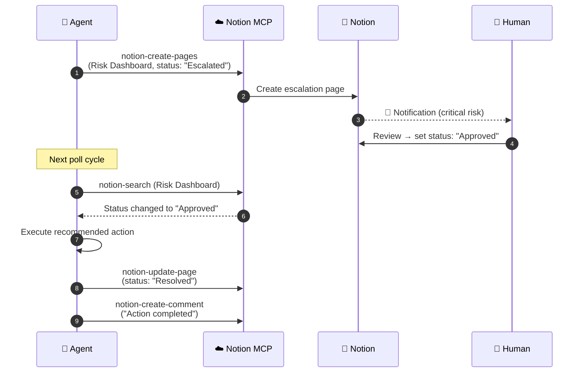
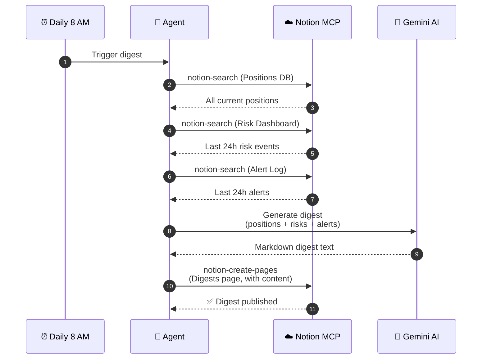
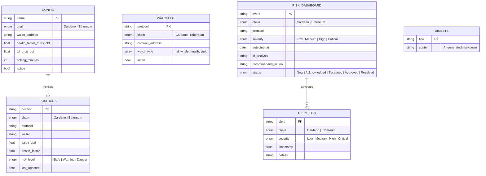

# VaultRoom — Data Flow

## Monitor Cycle

```mermaid
sequenceDiagram
    autonumber
    participant Cron as ⏰ Scheduler
    participant Agent as 🏦 Agent
    participant MCP as ☁️ Notion MCP
    participant Notion as 📓 Notion Workspace
    participant Chain as ⛓️ Blockchain
    participant AI as 🤖 Gemini AI

    Note over Cron,AI: Every N minutes (configurable per wallet)

    Cron->>Agent: Trigger monitor cycle

    rect rgb(30, 40, 60)
        Note over Agent,Notion: Phase 1 — Read Configuration
        Agent->>MCP: notion-search (Config DB)
        MCP->>Notion: Query database
        Notion-->>MCP: Config rows
        MCP-->>Agent: Wallets, thresholds, chains
        Agent->>MCP: notion-search (Watchlist DB)
        MCP-->>Agent: Protocols to monitor
    end

    rect rgb(40, 30, 50)
        Note over Agent,Chain: Phase 2 — On-Chain Data
        loop For each configured wallet
            Agent->>Chain: getWalletSnapshot()
            Chain-->>Agent: Balances, tokens, txs, staking
        end
    end

    rect rgb(50, 30, 30)
        Note over Agent,AI: Phase 3 — Risk Detection
        Agent->>Agent: Rule-based signal detection
        Note right of Agent: Health factor < threshold?<br/>TVL drop > X%?<br/>Whale movement?<br/>Unusual tx pattern?

        opt Signals detected
            Agent->>AI: Analyze risk signals
            AI-->>Agent: Severity, analysis,<br/>recommended action
        end
    end

    rect rgb(30, 50, 40)
        Note over Agent,Notion: Phase 4 — Write to Notion
        Agent->>MCP: notion-create-pages (Risk Dashboard)
        MCP->>Notion: Create risk event pages
        Agent->>MCP: notion-update-page (Positions DB)
        MCP->>Notion: Update position metrics
        Agent->>MCP: notion-create-pages (Alert Log)
        MCP->>Notion: Log alerts
    end

    Note over Cron,AI: Cycle complete — wait for next trigger
```

## Escalation Flow

```mermaid
sequenceDiagram
    autonumber
    participant Agent as 🏦 Agent
    participant MCP as ☁️ Notion MCP
    participant Notion as 📓 Notion
    participant Human as 👤 Human

    Agent->>MCP: notion-create-pages<br/>(Risk Dashboard, status: "Escalated")
    MCP->>Notion: Create escalation page

    Notion-->>Human: 🔔 Notification (critical risk)
    Human->>Notion: Review → set status: "Approved"

    Note over Agent: Next poll cycle
    Agent->>MCP: notion-search (Risk Dashboard)
    MCP-->>Agent: Status changed to "Approved"

    Agent->>Agent: Execute recommended action
    Agent->>MCP: notion-update-page<br/>(status: "Resolved")
    Agent->>MCP: notion-create-comment<br/>("Action completed")
```

## Daily Digest Flow

```mermaid
sequenceDiagram
    autonumber
    participant Cron as ⏰ Daily 8 AM
    participant Agent as 🏦 Agent
    participant MCP as ☁️ Notion MCP
    participant AI as 🤖 Gemini AI

    Cron->>Agent: Trigger digest

    Agent->>MCP: notion-search (Positions DB)
    MCP-->>Agent: All current positions

    Agent->>MCP: notion-search (Risk Dashboard)
    MCP-->>Agent: Last 24h risk events

    Agent->>MCP: notion-search (Alert Log)
    MCP-->>Agent: Last 24h alerts

    Agent->>AI: Generate digest<br/>(positions + risks + alerts)
    AI-->>Agent: Markdown digest text

    Agent->>MCP: notion-create-pages<br/>(Digests page, with content)
    MCP-->>Agent: ✅ Digest published
```

## Notion Database Relationships

```mermaid
erDiagram
    CONFIG ||--o{ POSITIONS : "monitors"
    CONFIG {
        string name PK
        enum chain "Cardano | Ethereum"
        string wallet_address
        float health_factor_threshold
        float tvl_drop_pct
        int polling_minutes
        bool active
    }

    WATCHLIST {
        string protocol PK
        enum chain "Cardano | Ethereum"
        string contract_address
        array watch_type "tvl, whale, health, yield"
        bool active
    }

    POSITIONS {
        string position PK
        enum chain "Cardano | Ethereum"
        string protocol
        string wallet
        float value_usd
        float health_factor
        enum risk_level "Safe | Warning | Danger"
        date last_updated
    }

    RISK_DASHBOARD ||--o{ ALERT_LOG : "generates"
    RISK_DASHBOARD {
        string event PK
        enum chain "Cardano | Ethereum"
        string protocol
        enum severity "Low | Medium | High | Critical"
        date detected_at
        string ai_analysis
        string recommended_action
        enum status "New | Acknowledged | Escalated | Approved | Resolved"
    }

    ALERT_LOG {
        string alert PK
        enum chain "Cardano | Ethereum"
        enum severity "Low | Medium | High | Critical"
        date timestamp
        string details
    }

    DIGESTS {
        string title PK
        string content "AI-generated markdown"
    }
```
