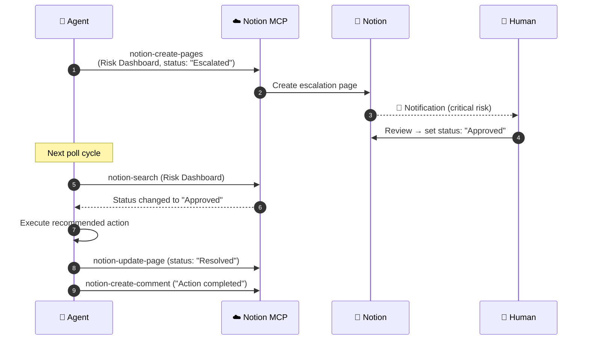
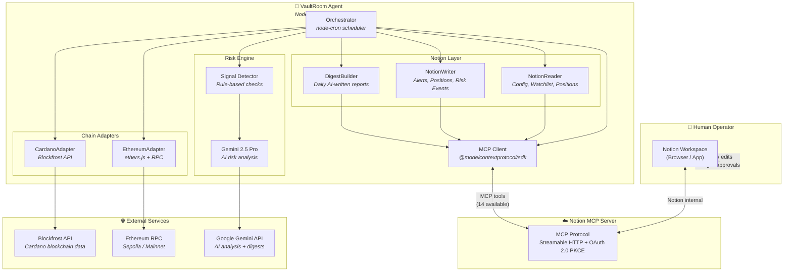
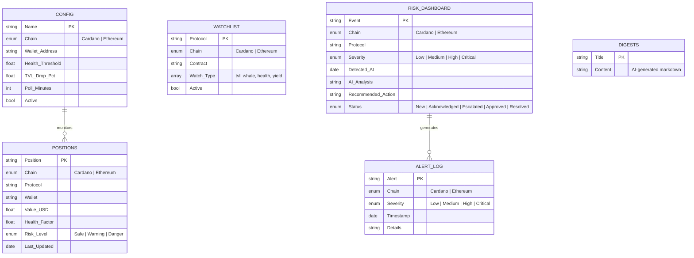

*This is a submission for the [Notion MCP Challenge](https://dev.to/challenges/notion-2026-03-04)*

## What I Built

DeFi operators managing lending positions across multiple blockchains face a familiar problem: alerts scattered across Discord bots, risk tracking in spreadsheets, and critical decisions made via Telegram messages. There's no single source of truth, no structured escalation workflow, and no clean way for a human to stay in the loop when an AI agent flags something dangerous.

**VaultRoom** is a multi-chain DeFi risk monitoring agent that turns Notion into a **bidirectional control plane**. The agent monitors on-chain positions across Cardano and Ethereum, detects anomalies using rule-based checks and Gemini 2.5 Pro analysis, and manages a living Notion workspace — where human operators set thresholds, approve escalations, and receive AI-written daily digests.

Every single Notion interaction flows through the **remote Notion MCP server** via OAuth. Zero `@notionhq/client` SDK usage. MCP is the protocol layer between the agent and Notion.

**The key idea: Notion isn't a dashboard. It's the control plane. Data flows both ways.**

### What the agent does:

- Polls **Cardano** (Blockfrost) and **Ethereum** (ethers.js) for wallet balances and transactions
- Detects risk signals: health factor drops, whale movements, balance anomalies
- Calls **Gemini 2.5 Pro** to analyze critical signals and generate plain-English risk assessments
- Writes risk events, position updates, and alerts to Notion databases via MCP
- **Escalates critical alerts** and waits for human approval in Notion before resolving
- Leaves **comments** on Notion pages to acknowledge human decisions
- Generates rich **daily digest pages** with tables, callouts, and toggles — all via Notion-flavored Markdown through MCP

### What the human does (in Notion):

- Configures which wallets to monitor and sets alert thresholds
- Adds protocols to a watchlist
- Reviews AI-generated risk analysis
- Approves or rejects escalated alerts by changing a status field
- Reads daily portfolio digests

<!-- TODO: Add 2-3 screenshots:
1. Risk Dashboard DB showing a critical event with AI analysis
2. The escalation flow: Escalated → Approved → Resolved with agent comment
3. A daily digest page with tables and recommendations
-->

## Video Demo

<!-- TODO: Record and embed a 2-minute demo video -->

## Show us the code



## How I Used Notion MCP

This is where I went deep. VaultRoom connects to Notion's **remote hosted MCP server** (`https://mcp.notion.com/mcp`) via OAuth 2.0 with PKCE and uses **7 MCP tools** as its core integration:

| MCP Tool | Direction | How VaultRoom Uses It |
|----------|-----------|----------------------|
| `notion-search` | Read | Finds databases by name, locates existing position pages for upsert logic |
| `notion-fetch` | Read | Reads Config DB to get thresholds, reads Watchlist, polls Risk Dashboard for human approvals |
| `notion-create-pages` | Write | Creates risk events, position entries, alert log items, and daily digest pages |
| `notion-update-page` | Write | Updates position data on re-scan, resolves escalated events after human approval |
| `notion-create-database` | Write | Scaffolds the entire 6-database Notion workspace using SQL DDL syntax |
| `notion-create-comment` | Write | Agent leaves acknowledgment comments on escalated items after human approves |
| `notion-get-comments` | Read | Reads discussion threads on escalated risk events |

### The Bidirectional Loop

This is what makes VaultRoom more than a write-only bot. Data flows **both ways** through MCP:

**Human → Agent** (operator configures via Notion UI):
- Edit the ⚙️ Config database to add wallets, set health factor thresholds, toggle monitoring on/off
- Add protocols to the 👁️ Watchlist with specific risk types to track
- Change an escalated event's status from "Escalated" → "Approved" to authorize agent action

**Agent → Human** (VaultRoom writes via MCP):
- Creates pages in 🚨 Risk Dashboard with AI-analyzed severity, plain-English analysis, and recommended actions
- Updates 📊 Positions with current on-chain values and health factors
- Logs every alert in 📋 Alert Log with timestamps
- Publishes 📝 Daily Digests as rich Notion pages with tables, callouts, and toggle sections

### The Escalation Flow (the MCP showcase)

This is the most interesting part — a full human-in-the-loop approval cycle powered entirely by MCP:

1. Agent detects a critical risk signal (e.g., health factor at 1.08 on a lending position)
2. `notion-create-pages` → creates a risk event with status "Escalated" and AI analysis
3. The agent polls with `notion-search` every cycle, checking for status changes
4. A human reviews the risk in Notion and changes status to "Approved"
5. Agent detects the approval → `notion-update-page` to mark "Resolved"
6. `notion-create-comment` → agent leaves a timestamped acknowledgment in the Notion discussion thread

No webhooks, no external notification system — just an agent and a human coordinating through Notion via MCP.

### Architecture

### Monitor Cycle Data Flow

Each monitoring cycle follows this pattern — reading config from Notion, fetching on-chain data, detecting risks, and writing results back:

```mermaid
sequenceDiagram
    autonumber
    participant Cron as ⏰ Scheduler
    participant Agent as 🏦 Agent
    participant MCP as ☁️ Notion MCP
    participant Notion as 📓 Notion
    participant Chain as ⛓️ Blockchain
    participant AI as 🤖 Gemini AI

    Cron->>Agent: Trigger monitor cycle

    rect rgb(30, 40, 60)
        Note over Agent,Notion: Phase 1 — Read Config from Notion
        Agent->>MCP: notion-search (Config DB)
        MCP-->>Agent: Wallets, thresholds, chains
        Agent->>MCP: notion-search (Watchlist DB)
        MCP-->>Agent: Protocols to monitor
    end

    rect rgb(40, 30, 50)
        Note over Agent,Chain: Phase 2 — Fetch On-Chain Data
        loop For each wallet
            Agent->>Chain: getWalletSnapshot()
            Chain-->>Agent: Balances, tokens, txs
        end
    end

    rect rgb(50, 30, 30)
        Note over Agent,AI: Phase 3 — Risk Detection + AI
        Agent->>Agent: Rule-based signal detection
        opt Critical signals
            Agent->>AI: Analyze risk signals
            AI-->>Agent: Severity + recommendations
        end
    end

    rect rgb(30, 50, 40)
        Note over Agent,Notion: Phase 4 — Write Results to Notion
        Agent->>MCP: notion-create-pages (Risk Events)
        Agent->>MCP: notion-update-page (Positions)
        Agent->>MCP: notion-create-pages (Alert Log)
    end
```

### Notion Database Schema

VaultRoom manages 6 interconnected databases in Notion, all created programmatically via MCP:

### Lessons Learned: MCP Quirks

Building a custom MCP client against the hosted Notion MCP server taught me things the docs don't mention:

1. **The hosted MCP has its own OAuth** — it uses PKCE with dynamic client registration. You can't just use a Notion REST API token. I had to implement the full RFC 9470 → RFC 8414 discovery flow, register a client dynamically, and handle token refresh.

2. **SQL DDL for database creation** — The hosted MCP uses `CREATE TABLE` syntax with custom types (`TITLE`, `RICH_TEXT`, `SELECT('opt1', 'opt2')`, `MULTI_SELECT`, `CHECKBOX`). Not the JSON schema from the REST API.

3. **Property value formats are SQLite-flavored** — Checkboxes are `"__YES__"` / `"__NO__"` (not booleans). Dates need expanded keys like `"date:Field Name:start"`. Multi-selects are JSON array strings like `'["tvl", "yield"]'`.

4. **Pages in databases use `data_source_id`** — When creating rows, you reference the `collection://` ID, not the database page ID.

5. **Page content is Notion-flavored Markdown** — Blockquotes become callouts, `
` become toggles, and tables render as rich Notion blocks. This made the daily digest pages look great without any block API calls.

## Tech Stack

| Layer | Technology |
|---|---|
| Runtime | Node.js 20 + TypeScript (strict) |
| MCP Client | `@modelcontextprotocol/sdk` (Streamable HTTP) |
| Notion MCP | Remote hosted `mcp.notion.com` (OAuth 2.0 PKCE) |
| Cardano | `@blockfrost/blockfrost-js` (Preprod testnet) |
| Ethereum | `ethers` v6 (Sepolia testnet) |
| AI | `@google/generative-ai` (Gemini 2.5 Pro) |
| Scheduler | `node-cron` |
| Validation | `zod` |
| Logging | `winston` |

---

*Built solo for the Notion MCP Challenge · March 2026*
